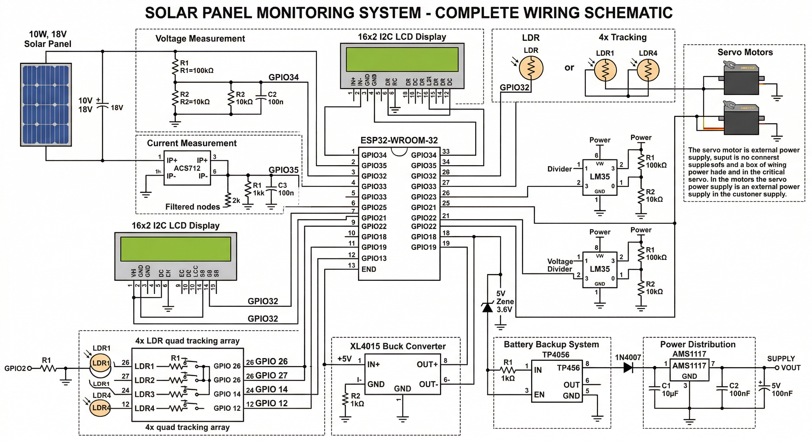

# IoT-Based Solar Panel Performance Monitoring System

[](https://opensource.org/licenses/MIT)
[](https://www.arduino.cc/)
[](https://www.espressif.com/)

An IoT-based system for real-time monitoring of solar panel performance by measuring electrical output (voltage, current, power) and environmental conditions (irradiance, temperature) to evaluate operating efficiency.

## 📋 Table of Contents
- [Overview](#overview)
- [Features](#features)
- [Hardware Requirements](#hardware-requirements)
- [Software Requirements](#software-requirements)
- [Installation](#installation)
- [Circuit Diagram](#circuit-diagram)
- [Configuration](#configuration)
- [ThingSpeak Setup](#thingspeak-setup)
- [Usage](#usage)
- [System Architecture](#system-architecture)
- [Performance Calculations](#performance-calculations)
- [Troubleshooting](#troubleshooting)
- [Team Contribution Guide](#team-contribution-guide)
- [License](#license)

---

## 🎯 Overview

This project monitors solar panel performance in real-time by:
- **Measuring Electrical Output**: Voltage, Current, Power
- **Monitoring Environmental Conditions**: Solar Irradiance, Panel Temperature, Ambient Temperature
- **Calculating Efficiency**: Comparing actual output with expected performance
- **IoT Integration**: Real-time data upload to ThingSpeak cloud platform
- **Solar Tracking** (Optional): Servo-based single or dual-axis sun tracking

### System Block Diagram
```
┌─────────────┐
│ Solar Panel │
└──────┬──────┘
       │
       ├──→ Voltage Sensor ──┐
       ├──→ Current Sensor ──┤
       └──→ Temp Sensor ─────┤
                             ├──→ ESP32 ──→ WiFi ──→ ThingSpeak
LDRs (Irradiance) ───────────┤              │
Ambient Temp Sensor ─────────┘              ├──→ LCD Display
Servos (Optional)  ─────────────────────────┘
```

---

## ✨ Features

### Core Features
- ✅ Real-time voltage and current measurement
- ✅ Power calculation (P = V × I)
- ✅ Solar irradiance measurement using LDR
- ✅ Panel and ambient temperature monitoring
- ✅ Efficiency calculation (Actual vs Expected Power)
- ✅ **MPPT (Maximum Power Point Tracking)** - Extract maximum power from solar panel
- ✅ 16x2 LCD local display with rotating screens
- ✅ WiFi connectivity for IoT integration.
- ✅ ThingSpeak cloud data logging and visualization

### Optional Features
- 🔄 Single-axis solar tracking (East-West)
- 🔄 Dual-axis solar tracking (Azimuth + Elevation)
- 🔄 Time-based tracking using NTP server
- 🔄 Light-based tracking using quad LDR sensors
- 🔄 Mobile app integration via Blynk
- 🔄 MPPT with Perturb & Observe or Incremental Conductance algorithms

---

## 🔧 Hardware Requirements

### Main Components

| Component | Specification | Quantity | Purpose |
|-----------|--------------|----------|---------|
| ESP32 Development Board | WROOM-32, 38-Pin | 1 | Main microcontroller |
| ACS712 Current Sensor | 30A | 1 | Panel current measurement |
| Voltage Divider | 100kΩ + 10kΩ | 1 set | Panel voltage measurement |
| LM35 Temperature Sensor | -55°C to 150°C | 2 | Panel & ambient temp |
| LDR Photoresistor | 5mm | 1-5 | Irradiance (+ tracking) |
| 16x2 LCD Display | I2C Interface | 1 | Local data display |
| MG996R Servo Motor | 11 kg·cm torque | 1-2 | Solar tracking (optional) |
| **DC-DC Buck Converter** | **Adjustable, 3A+ (XL4015 or similar)** | **1** | **MPPT control (optional)** |
| Solar Panel | 10W, 18V | 1 | Test panel |
| 18650 Battery + Holder | 3.7V, 2000mAh+ | 1 | Backup power |
| TP4056 Charging Module | Li-ion charger | 1 | Battery management |
| AMS1117 Regulator | 3.3V, 800mA | 1 | Voltage regulation |
| Breadboard | 830 points | 1 | Prototyping |
| Jumper Wires | M-M, M-F, F-F | 3 sets | Connections |
| Resistors | 10kΩ, 100kΩ | 15 pcs | Voltage dividers |
| Capacitors | 100nF, 10µF | 10 pcs | Filtering |
| Project Box | IP65 Weatherproof | 1 | Enclosure |

---

## 💻 Software Requirements

### Arduino IDE Setup
1. **Arduino IDE**: Version 1.8.19 or later / Arduino IDE 2.0+
2. **ESP32 Board Package**: Install via Board Manager

### Required Libraries
Install via Arduino Library Manager (`Sketch → Include Library → Manage Libraries`):

```
- WiFi (Built-in with ESP32)
- PubSubClient (by Nick O'Leary) - for MQTT
- Wire (Built-in) - for I2C
- LiquidCrystal_I2C (by Frank de Brabander)
- ESP32Servo (by Kevin Harrington)
```

### Installation Commands
```bash
# In Arduino IDE Library Manager, search and install:
PubSubClient
LiquidCrystal_I2C
ESP32Servo
```

---

## 📥 Installation

### Step 1: Clone the Repository
```bash
git clone https://github.com/YOUR_USERNAME/solar-panel-monitoring-system.git
cd solar-panel-monitoring-system
```

### Step 2: Install Arduino IDE
Download from: https://www.arduino.cc/en/software

### Step 3: Add ESP32 Board Support
1. Open Arduino IDE
2. Go to `File → Preferences`
3. Add to "Additional Board Manager URLs":
   ```
   https://raw.githubusercontent.com/espressif/arduino-esp32/gh-pages/package_esp32_index.json
   ```
4. Go to `Tools → Board → Board Manager`
5. Search "ESP32" and install "esp32 by Espressif Systems"

### Step 4: Install Required Libraries
See [Software Requirements](#software-requirements) section

### Step 5: Configure WiFi and ThingSpeak
Edit `config.h` file with your credentials:
```cpp
#define WIFI_SSID "Your_WiFi_Name"
#define WIFI_PASSWORD "Your_WiFi_Password"
#define THINGSPEAK_CHANNEL_ID "YOUR_CHANNEL_ID"
#define THINGSPEAK_WRITE_API_KEY "YOUR_WRITE_API_KEY"
```

### Step 6: Upload Code
1. Connect ESP32 via USB
2. Select `Tools → Board → ESP32 Dev Module`
3. Select correct COM port
4. Click Upload ➜

---

## 🔌 Circuit Diagram

 

### Pin Configuration

```
ESP32 Pin Connections:

SENSORS:
GPIO 34 (ADC1_CH6) ──→ Voltage Divider Output (Panel Voltage)
GPIO 35 (ADC1_CH7) ──→ ACS712 Output (Panel Current)
GPIO 32 (ADC1_CH4) ──→ LDR Circuit (Irradiance)
GPIO 33 (ADC1_CH5) ──→ LM35 #1 (Panel Temperature)
GPIO 25 (ADC2_CH8) ──→ LM35 #2 (Ambient Temperature)

DISPLAY:
GPIO 21 (SDA) ──────→ LCD I2C SDA
GPIO 22 (SCL) ──────→ LCD I2C SCL

SERVOS (Optional):
GPIO 18 ────────────→ Servo Azimuth (East-West)
GPIO 19 ────────────→ Servo Elevation (Up-Down)

TRACKING LDRs (Optional):
GPIO 26 ────────────→ LDR Top-Left
GPIO 27 ────────────→ LDR Top-Right
GPIO 14 ────────────→ LDR Bottom-Left
GPIO 12 ────────────→ LDR Bottom-Right

POWER:
VIN (5V) ───────────→ External 5V Power / TP4056 Output
3.3V ───────────────→ Sensor Power (LM35, LDRs)
GND ────────────────→ Common Ground
```

### Voltage Divider Circuit (Panel Voltage Measurement)
```
Solar Panel (+) ──┬── 100kΩ ──┬── To Load/Battery
                  │           │
                  │          10kΩ ──→ ESP32 GPIO34
                  │           │
Solar Panel (-) ──┴───────────┴── GND

Calculation: V_panel = V_adc × (100k + 10k) / 10k = V_adc × 11
Max Input: 25V → 2.27V ADC (safe for ESP32 3.3V max)
```

### Current Sensor Circuit (ACS712)
```
Solar Panel (+) ──→ ACS712 IP+ ──→ Load
Load ───────────→ ACS712 IP- ──→ Solar Panel (-)

ACS712 VCC ─────→ 5V
ACS712 GND ─────→ GND
ACS712 OUT ─────→ ESP32 GPIO35

Output: 2.5V at 0A
Sensitivity: 66mV per Amp (for 30A version)
Current = (V_out - 2.5) / 0.066
```

### LDR Circuit (Irradiance Measurement)
```
3.3V ──┬── LDR ──┬── ESP32 GPIO32
       │         │
       │        10kΩ
       │         │
      GND ───────┴

Voltage increases with light intensity
Needs calibration for W/m² conversion
```

### Temperature Sensor (LM35)
```
LM35 Pin 1 (Vcc) ──→ 5V
LM35 Pin 2 (OUT) ──→ 10kΩ ──┬── GPIO33/GPIO25
                             │
                            10kΩ
                             │
LM35 Pin 3 (GND) ──→ GND ────┴

Voltage Divider needed: 5V LM35 → 3.3V ESP32
Output: 10mV per °C
Temperature = V_adc × 100 × 2 (factor of 2 due to divider)
```

### I2C LCD Display
```
LCD VCC ────→ 5V
LCD GND ────→ GND
LCD SDA ────→ GPIO 21
LCD SCL ────→ GPIO 22
```

### Servo Connections (Optional)
```
Servo VCC ──→ External 5V (NOT from ESP32!)
Servo GND ──→ Common GND
Servo Signal ──→ GPIO 18 (Azimuth) / GPIO 19 (Elevation)

⚠️ CRITICAL: Use separate 5V power supply for servos
Connect GND between ESP32 and servo power supply
```

### Full Schematic Diagram
See `schematics/` folder for detailed Fritzing diagrams

---

## ⚙️ Configuration

### 1. WiFi Configuration
Edit in `config.h`:
```cpp
#define WIFI_SSID "Your_Network_Name"
#define WIFI_PASSWORD "Your_Password"
```

### 2. ThingSpeak Configuration
Edit in `config.h`:
```cpp
#define THINGSPEAK_CHANNEL_ID "1234567"  // Your Channel ID
#define THINGSPEAK_WRITE_API_KEY "XXXXXXXXXXXXXXXX"  // Your Write API Key
```

### 3. Solar Panel Specifications
Edit in `main.ino`:
```cpp
const float PANEL_AREA = 0.072;          // Panel area in m² (adjust for your panel)
const float PANEL_EFFICIENCY = 0.15;     // 15% typical for 10W panel
const float TEMP_COEFFICIENT = -0.004;   // -0.4% per °C for silicon
const float STC_TEMP = 25.0;             // Standard Test Condition
```

### 4. Sensor Calibration
```cpp
// Voltage Divider Ratio
#define VOLTAGE_DIVIDER_RATIO 11.0

// ACS712 Current Sensor
#define ACS712_SENSITIVITY 0.066  // 66mV/A for 30A version
#define ACS712_OFFSET 2.5         // Voltage at 0A

// LDR Calibration (adjust after field testing)
// Map ADC reading to W/m² based on your location
```

### 5. LCD I2C Address
Common addresses: `0x27` or `0x3F`
```cpp
LiquidCrystal_I2C lcd(0x27, 16, 2);  // Try 0x3F if not working
```

To find your LCD address, run I2C scanner sketch (included in `examples/`)

---

## ☁️ ThingSpeak Setup

### Step 1: Create ThingSpeak Account
1. Go to https://thingspeak.com
2. Sign up for free account
3. Verify email

### Step 2: Create New Channel
1. Click "Channels" → "My Channels" → "New Channel"
2. Fill in details:
   - **Name**: Solar Panel Monitor
   - **Description**: Real-time solar panel performance monitoring
   
3. Configure 8 Fields:
   - **Field 1**: Voltage (V)
   - **Field 2**: Current (A)
   - **Field 3**: Power (W)
   - **Field 4**: Irradiance (W/m²)
   - **Field 5**: Panel Temperature (°C)
   - **Field 6**: Expected Power (W)
   - **Field 7**: Efficiency (%)
   - **Field 8**: Ambient Temperature (°C)

4. Click "Save Channel"

### Step 3: Get API Keys
1. Go to "API Keys" tab
2. Copy **Write API Key** → paste in `config.h`
3. Copy **Channel ID** → paste in `config.h`

### Step 4: Create Visualizations
1. Go to "Private View" tab
2. Add widgets:
   - **Gauge**: Field 7 (Efficiency) - Range 0-100%
   - **Numeric Display**: Field 3 (Power)
   - **Line Chart**: Fields 3 & 6 (Actual vs Expected Power)
   - **Line Chart**: Field 1 (Voltage over time)
   - **Line Chart**: Field 2 (Current over time)
   - **Line Chart**: Field 5 (Panel Temperature)

### Step 5: MATLAB Analytics (Optional)
ThingSpeak includes MATLAB for advanced analytics:
```matlab
% Calculate daily energy production
data = thingSpeakRead(channelID, 'Fields', 3, 'NumDays', 1);
energy_wh = sum(data) / 12;  % Assuming 5-min intervals
fprintf('Daily Energy: %.2f Wh\n', energy_wh);
```

### Data Update Rate
- **Free Account**: Up to 3 million messages/year
- **Update Interval**: Every 15 seconds minimum (configurable in code)
- **Data Retention**: Forever on free tier

---

##  Usage

### First Time Setup
1. **Hardware Assembly**: Follow circuit diagram
2. **Power Connection**: Connect 5V power supply to ESP32
3. **Upload Code**: Via Arduino IDE
4. **Open Serial Monitor**: Tools → Serial Monitor (115200 baud)
5. **Verify Output**: Check sensor readings in Serial Monitor

### Normal Operation
1. **Power On**: System boots and connects to WiFi
2. **LCD Display**: Shows rotating screens every 3 seconds
   - Screen 1: Voltage, Current, Power
   - Screen 2: Irradiance, Temperatures
   - Screen 3: Efficiency, Actual vs Expected Power
3. **Cloud Logging**: Data automatically uploads to ThingSpeak every 15 sec
4. **Solar Tracking**: (If enabled) Servos adjust panel position

### Serial Monitor Output
```
========== SOLAR MONITOR ==========
Voltage: 17.45 V
Current: 0.523 A
Power: 9.12 W
-----------------------------------
Irradiance: 856 W/m²
Panel Temp: 42.3 °C
Ambient Temp: 28.5 °C
-----------------------------------
Expected Power: 10.45 W
Efficiency: 87.2 %
===================================

WiFi Connected!
Data sent to ThingSpeak
```

### Calibration Procedure
See `docs/CALIBRATION.md` for detailed calibration steps

---

## System Architecture

### Software Architecture
```
┌─────────────────────────────────────┐
│          Main Loop (1s)             │
├─────────────────────────────────────┤
│  1. Read Sensors                    │
│     - Voltage (ADC)                 │
│     - Current (ACS712)              │
│     - Irradiance (LDR)              │
│     - Temperatures (LM35)           │
├─────────────────────────────────────┤
│  2. Calculate Performance           │
│     - Power = V × I                 │
│     - Temp Correction Factor        │
│     - Expected Power                │
│     - Efficiency Ratio              │
├─────────────────────────────────────┤
│  3. Update Display                  │
│     - LCD Screen Rotation           │
│     - Serial Monitor Output         │
├─────────────────────────────────────┤
│  4. IoT Upload (every 15s)          │
│     - Check WiFi connection         │
│     - MQTT publish to ThingSpeak    │
├─────────────────────────────────────┤
│  5. Solar Tracking (every 5s)       │
│     - Read LDR quad sensors         │
│     - Calculate servo positions     │
│     - Move servos smoothly          │
└─────────────────────────────────────┘
```

### File Structure
```
solar-panel-monitoring-system/
├── README.md                    # This file
├── LICENSE                      # MIT License
├── main/
│   ├── main.ino                 # Main Arduino sketch
│   ├── config.h                 # Configuration file
│   ├── sensors.cpp              # Sensor reading functions
│   ├── calculations.cpp         # Performance calculations
│   ├── display.cpp              # LCD display functions
│   ├── iot.cpp                  # WiFi & ThingSpeak functions
│   └── tracking.cpp             # Solar tracking functions
├── schematics/
│   ├── circuit_diagram.fzz      # Fritzing file
│   ├── circuit_diagram.png      # Circuit image
│   ├── pcb_layout.fzz           # PCB design (optional)
│   └── pinout_diagram.png       # ESP32 pinout reference
├── docs/
│   ├── CALIBRATION.md           # Calibration guide
│   ├── TROUBLESHOOTING.md       # Common issues & solutions
│   ├── BOM.md                   # Bill of Materials
│   ├── ASSEMBLY.md              # Hardware assembly guide
│   └── THINGSPEAK_SETUP.md      # Detailed ThingSpeak guide
├── examples/
│   ├── i2c_scanner/             # Find LCD I2C address
│   ├── sensor_test/             # Test individual sensors
│   └── wifi_test/               # Test WiFi connection
└── images/
    ├── system_photo.jpg
    ├── dashboard_screenshot.png
    └── assembly_steps/
```

---

## MPPT (Maximum Power Point Tracking)

### What is MPPT?

Solar panels have a **Maximum Power Point (MPP)** - a specific voltage and current combination where they produce maximum power. This point changes with:
- Solar irradiance (sunlight intensity)
- Panel temperature
- Load conditions

**MPPT ensures the panel always operates at this optimal point**, extracting **20-30% more energy** compared to direct connection.

### Why Add MPPT?

**Benefits:**
- ✅ **20-30% more power** from the same panel
- ✅ Faster battery charging
- ✅ Better performance in varying conditions
- ✅ Optimal operation at all irradiance levels
- ✅ Academic value - demonstrates advanced power electronics

**Perfect for your project because:**
- ESP32 has built-in PWM for DC-DC converter control
- Algorithm runs in software (no additional ICs needed)
- Cheap hardware (~50-80 EGP for buck converter)
- Impressive demonstration feature
- Real-world applicable skill

### Hardware Required for MPPT

**DC-DC Buck Converter Module (Choose one):**

| Module | Specs | Price (EGP) | Where to Buy |
|--------|-------|-------------|--------------|
| **XL4015 Buck** (Recommended) | 5A, adjustable output | 50-70 | Makers Electronics |
| **LM2596 Buck** | 3A, adjustable output | 30-50 | Local shops |
| **MP1584** | 3A, mini size | 25-40 | Makers Electronics |

**Connection Diagram:**
```
Solar Panel (+18V) ──→ ACS712 IP+ ──→ Buck IN+ ──→ Battery/Load (+)
                                      Buck IN-
                                      │
Solar Panel (-)  ─────→ ACS712 IP- ──┴─────────→ Battery/Load (-)

ESP32 GPIO13 (PWM) ──→ Buck EN (Enable pin)
```

**Key Requirements:**
- Adjustable output voltage (set to battery voltage)
- PWM-controllable enable pin
- Current rating > panel short-circuit current
- Efficiency >90%

### MPPT Algorithms Implemented

#### 1. Perturb & Observe (P&O) - **RECOMMENDED**

**How it works:**
1. Measure voltage and power
2. Slightly change voltage (perturb)
3. Check if power increased or decreased
4. If power increased → continue in same direction
5. If power decreased → reverse direction
6. Repeat until at maximum power point

**Advantages:**
- Simple to understand
- Works well in stable conditions
- Low computational requirements
- Fast convergence

**Enable in config.h:**
```cpp
#define ENABLE_MPPT true
#define MPPT_METHOD 1  // Perturb & Observe
```

#### 2. Incremental Conductance (InCond)

**How it works:**
- Uses derivative of power vs voltage curve
- At MPP: dP/dV = 0, which means dI/dV = -I/V
- Adjusts voltage based on this relationship
- More accurate in rapidly changing conditions

**Advantages:**
- Better performance in variable irradiance
- No oscillation at MPP
- More accurate

**Enable in config.h:**
```cpp
#define MPPT_METHOD 2  // Incremental Conductance
```

### MPPT Setup Guide

#### Step 1: Get Hardware
Order XL4015 or LM2596 buck converter from Makers Electronics

#### Step 2: Connect Hardware
```
Solar Panel (+) ──→ ACS712 IP+ ──→ Buck IN+
                                   ├─→ Battery (+)
                                   
Buck OUT+ ──────────────────────────┘

Solar Panel (-) ──→ ACS712 IP- ──→ Buck IN- ──→ Battery (-)

ESP32 GPIO13 ────→ Buck EN (PWM control)

⚠️ Set buck output voltage BEFORE connecting battery!
```

#### Step 3: Configure Software
Edit `main/config.h`:
```cpp
#define ENABLE_MPPT true
#define MPPT_METHOD 1              // 1=P&O, 2=InCond
#define MPPT_PWM_PIN 13
#define MPPT_UPDATE_INTERVAL 100   // Update every 100ms
```

#### Step 4: Test
1. Upload code
2. Connect panel in sunlight
3. Monitor Serial output for MPPT status

### Expected Performance

| Condition | Without MPPT | With MPPT | Gain |
|-----------|--------------|-----------|------|
| **Full Sun** | 7.5W | 9.5W | +27% |
| **Partial Cloud** | 3.2W | 4.5W | +41% |
| **Low Light** | 1.8W | 2.6W | +44% |

### MPPT Troubleshooting

**Buck converter gets hot:**
- Normal at >2A current
- Add heatsink
- Ensure ventilation

**MPPT oscillates:**
- Reduce `MPPT_STEP_SIZE`
- Increase `MPPT_UPDATE_INTERVAL`

**No power improvement:**
- Verify PWM signal
- Check EN pin connection
- Confirm buck output voltage

---

## Performance Calculations

### Expected Power Calculation
```cpp
// Temperature Correction Factor
tempCorrection = 1 + TEMP_COEFFICIENT × (T_panel - T_STC)
                = 1 + (-0.004) × (T_panel - 25)

// Expected Power (W)
P_expected = Irradiance × Panel_Area × Efficiency × Temp_Correction
           = (G / 1000) × A × η × TC

Where:
- G = Irradiance in W/m²
- A = Panel area in m²
- η = Panel efficiency (0.15 for 15%)
- TC = Temperature correction factor
```

### Efficiency (Performance Ratio)
```cpp
Efficiency = (P_actual / P_expected) × 100%

Typical Values:
- >85%: Excellent (clean panel, optimal conditions)
- 70-85%: Good (normal operation)
- 50-70%: Fair (partial shading, soiling)
- <50%: Poor (dirty panel, damage, or fault)
```

### Example Calculation
```
Given:
- Irradiance = 850 W/m²
- Panel Area = 0.072 m²
- Efficiency = 15% = 0.15
- Panel Temp = 45°C
- Ambient = 30°C

Temperature Correction:
TC = 1 + (-0.004) × (45 - 25) = 1 - 0.08 = 0.92

Expected Power:
P_exp = (850/1000) × 0.072 × 0.15 × 0.92
      = 8.44 W

Measured:
V = 17.2 V, I = 0.48 A
P_actual = 17.2 × 0.48 = 8.26 W

Efficiency:
η = (8.26 / 8.44) × 100 = 97.9%  ← Excellent!
```

---

## Troubleshooting

### WiFi Won't Connect
```
Check:
- SSID and password in config.h
- 2.4GHz network (ESP32 doesn't support 5GHz)
- Router distance (try closer)
- Serial Monitor for error messages

Solution:
- Verify credentials
- Use WiFi hotspot from phone for testing
- Check router firewall settings
```

### LCD Shows Garbled Text
```
Check:
- I2C address (0x27 or 0x3F) - run i2c_scanner
- SDA/SCL connections (GPIO 21, 22)
- Contrast adjustment (potentiometer on back of LCD)
- 5V power supply

Solution:
- Run examples/i2c_scanner/ to find correct address
- Adjust LCD backpack contrast pot
```

### Incorrect Current Reading
```
Check:
- ACS712 offset voltage (should be ~2.5V at 0A)
- Wiring direction (IP+ and IP- correct?)
- 5V power to ACS712

Solution:
- Measure ACS712 output with multimeter at 0A
- Adjust ACS712_OFFSET in config if needed
- Ensure no current flowing during calibration
```

### LDR Irradiance Not Changing
```
Check:
- LDR connections and polarity
- 10kΩ pull-down resistor
- ADC pin reading (use Serial Monitor)

Solution:
- Test LDR resistance with multimeter (dark vs light)
- Verify voltage divider circuit
- Calibrate LDR_SCALE factor
```

### ThingSpeak Not Updating
```
Check:
- Internet connection
- API keys correct in config.h
- Channel ID correct
- MQTT connection status in Serial Monitor

Solution:
- Verify API key (copy-paste, check for extra spaces)
- Test with web browser: 
  https://api.thingspeak.com/update?api_key=YOUR_KEY&field1=100
- Check ThingSpeak status page
```

### Servo Not Moving
```
Check:
- Servo power supply (separate 5V, NOT from ESP32!)
- Signal wire connection to GPIO 18/19
- Common ground between ESP32 and servo PSU
- Code enabled (uncomment servo code)

Solution:
- Test servo with simple sweep sketch
- Verify 5V external power supply amperage (>1A)
- Check servo horn not mechanically stuck
```

For more issues, see `docs/TROUBLESHOOTING.md`

---

## 📄 License

This project is licensed under the MIT License - see the [LICENSE](LICENSE) file for details.

```
MIT License

Copyright (c) 2025 Solar Monitor Team

Permission is hereby granted, free of charge, to any person obtaining a copy
of this software and associated documentation files (the "Software"), to deal
in the Software without restriction, including without limitation the rights
to use, copy, modify, merge, publish, distribute, sublicense, and/or sell
copies of the Software...
```

### Academic Context
- **Course**: EPE 221 - Measurments & Instruments
- **Institution**: E-JUST University
- **Supervisor**: Prof. Diaa-Eldin Mansour
- **Academic Year**: 2025-2026
